# Rénolab

Un projet d'intérêt général pour l'amélioration du service public de la rénovation énergétique des bâtiments résidentiels.

## Vue d'ensemble

```mermaid
flowchart TB
    usagers["👋 Usagers"]
    operateurs_cee["🪙 Obligés et Délégataires CEE"]
    anah["🪙 Anah"]
    collectivite["🪙 Collectivité locale"]
    professionnels["🛠️ Professionnels"]
    accompagnateurs["💡🛠️🪙 Accompagnateurs France Rénov'"]
    conseillers["💡 Conseillers France Rénov'"]
    controleurs["🔎 Organismes de contrôle"]
    etat["🏛️ Services de l'État"]
    simulateur_audit["⚙️ Simulateur Audit-DPE"]
    passeport_renovation["⚙️ Passeport rénovation"]
    guichet_unique_financement["⚙️ Guichet unique de financement"]
    guichet_unique_controle["⚙️ Guichet unique de contrôle"]

    usagers-->professionnels
    usagers-->accompagnateurs
    usagers-->conseillers

    professionnels<-->accompagnateurs

    accompagnateurs-->simulateur_audit
    accompagnateurs-->passeport_renovation
    accompagnateurs<-->guichet_unique_financement

    guichet_unique_financement<-->collectivite
    guichet_unique_financement<-->operateurs_cee
    guichet_unique_financement<-->anah

    operateurs_cee<-->guichet_unique_controle
    anah<-->guichet_unique_controle
    controleurs<-->guichet_unique_controle
    etat<-->guichet_unique_controle
```

## Enjeux

🤔 Comment évaluer l'impact d'un scénario de travaux sur la performance énergétique conventionnelle d'un logement ?

🤔 Comment garantir la cohérence d'un parcours de rénovation par étape sur le temps long ?

🤔 Comment faciliter le financement des travaux en limitant le reste à charge ?

🤔 Comment identifier les professionnels de la rénovation énergétique ?

🤔 Comment contrôler la qualité des travaux réalisés pour garantir l'atteinte des objectifs et éviter les abus ?

## Projets en cours

🚀 [@renolab/audit](https://github.com/renolab/audit) - Un simulateur des performances énergétiques conventionnelles des logements pour évaluer l'impact d'un scénario de rénovation énergétique

🚀 [@renolab/passeport-renovation](https://github.com/renolab/passeport-renovation) - Un service de pilotage et de suivi des parcours de rénovation performante par étape

🚀 [@renolab/financement](https://github.com/renolab/financement) - Un Guichet unique du financement des travaux de rénovation énergétique

🚀 [@renolab/controle](https://github.com/renolab/controle) - Un Guichet unique pour harmoniser et centraliser les contrôles des travaux de rénovation énergétique

🚀 [@renolab/annuaire](https://github.com/renolab/annuaire) - Un annuaire public des professionnels de la rénovation énergétique

## Open data

🚀 [@renolab/base-travaux](https://github.com/renolab/base-travaux) - Un répertoire des travaux de rénovation énergétique

## Contact et contribution

Les projets en cours sont ouverts aux contributions sur les dépôts dédiés.
